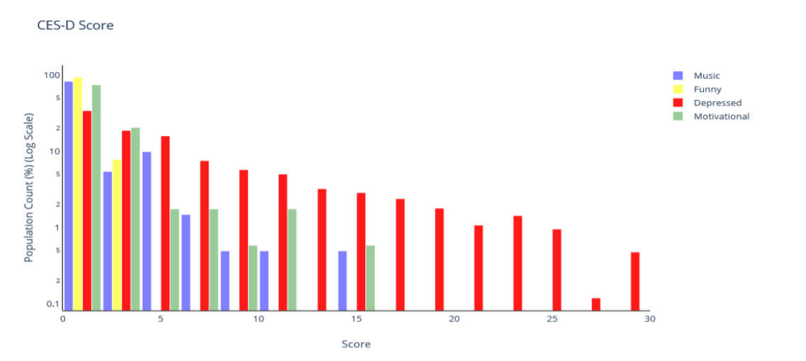
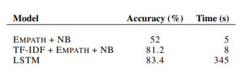

# Detecting-Depression-through-YouTube-history

## Introducton
This repository maintains the code from our experiments where we used Long Short-Term Memory(LSTM) networks to understand the video content from the transcripts in order to identify if a video can trigger depression. Additionally, we propose a novel method of validating the results by analysing the CESD score of comments. You can find more details about this experiment in our [paper](https://aiforsocialgood.github.io/neurips2019/accepted/track1/pdfs/52_aisg_neurips2019.pdf) / [poster](https://aiforsocialgood.github.io/neurips2019/accepted/track1/posters/52_aisg_neurips2019.pdf) that we presented at NeurIPS 2019 AI for Social Good Workshop. Our major contributions in this work are:

- We construct a classifier that can help understand the content of a video by classifying it as Depressive/NonDepressive.
- To provide a real-life validation of the classification results in above step, we propose a methodology to evaluate the comments posted for a video and determine a potential score that would have been obtained on a CES-D scale and use it as a real life proxy to judge the accuracy of the classification.

## Requirements

- [YouTube Data API](https://developers.google.com/youtube/v3)
- [Empath](http://empath.stanford.edu/)
- urllib
- pandas
- numpy

## Data Collection
The process of data collection has been explained in detail in Section 2.1. The code for the same can be found [here](dataset/comment_extract.py)

## Comments Evaluation
For evaluation of the comments, we introduce a scoring method (Section 3), called CES-D score, for each video to analyze how depressive the video is. The score is the density of the terms, derived from the various symptoms (Insomnia, Self-hate, Appetite, etc.) considered in the [CES-D scale](http://www.chcr.brown.edu/pcoc/cesdscale.pdf), present in a negative connotation within a given text. Code for the same can be found [here](evaluation/calc_cesd.py)

## Results
We compare the performance of various models on their ability to classify a video as depressive/non-depressive by processing its transcripts.

## Collaborators
[@manandey](https://github.com/manandey)

